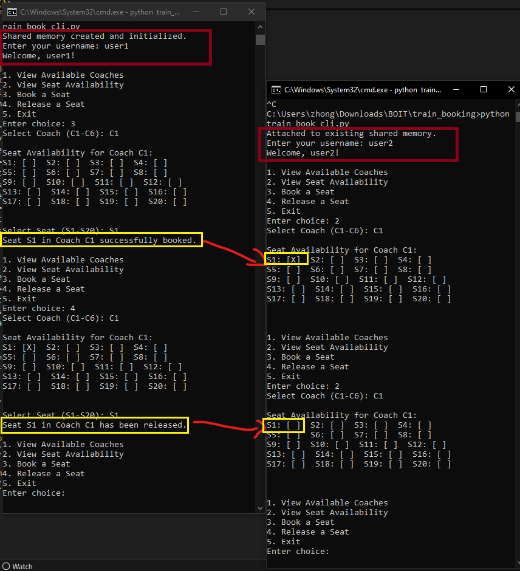

# Train Seat Booking CLI Application (IPC)

This repository contains a command-line interface (CLI) application for booking train seats using inter-process communication (IPC). The application utilizes Python's `multiprocessing` module to manage shared memory for seat availability across multiple processes.

## Table of Contents

- [Inter-Process Communication (IPC)](#inter-process-communication-ipc)
- [Prerequisites](#prerequisites)
- [Getting Started](#getting-started)
- [Usage](#usage)
- [Expected Result](#expected-result)
- [Script Overview](#script-overview)

## Inter-Process Communication (IPC)

This application leverages Python's `multiprocessing` module to implement inter-process communication (IPC) using shared memory. By utilizing `from multiprocessing import shared_memory`, the application ensures that multiple processes can efficiently read and update seat availability without conflicts. This approach improves performance and consistency when handling concurrent seat bookings and releases.

## Prerequisites

Ensure that you have the following installed on your system:

- Python 3.13.1 or later
- Necessary Python packages:
  - `numpy`

## Getting Started

1. **Clone the Repository**: Begin by cloning this repository to your local machine using Git:

   ```bash
   git clone https://github.com/ming0520/train-seat-booking-cli.git
   ```
2. **Navigate to the Project Directory**:

   ```bash
   cd train-seat-booking-cli
   ```
3. **Install Required Packages**: Install the necessary Python packages using pip:

   ```bash
   pip install numpy
   ```

## Usage

To run the Train Seat Booking CLI application, execute the following command in your terminal:

```bash
python train_book_cli.py
```

Follow the on-screen prompts to interact with the application. You can view available coaches, check seat availability, book seats, and release seats as needed.

## Expected Result

Upon running the application and performing various seat booking operations, you should see output similar to the following:



*Figure: Sample output of the Train Seat Booking CLI application.*
